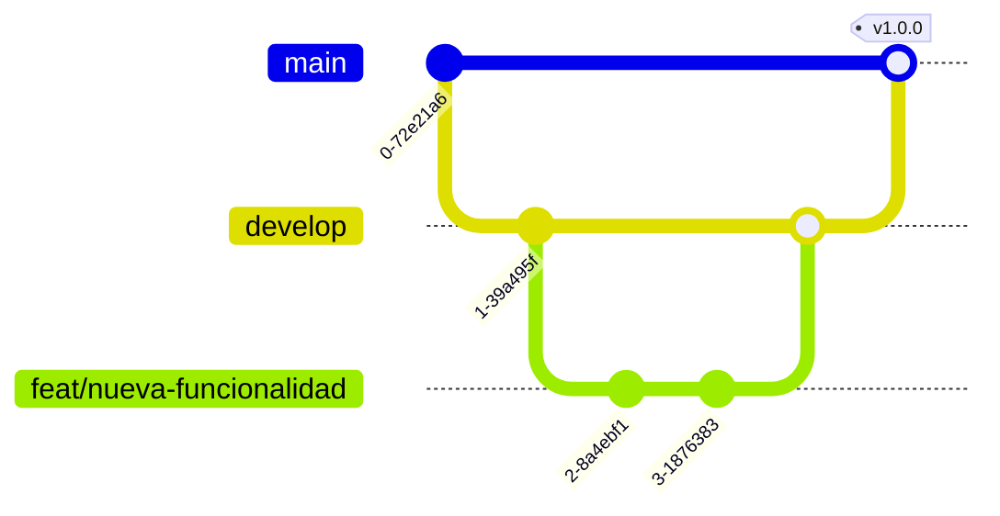

# Guía de Contribución

¡Gracias por tu interés en contribuir a **Apoyo Desafios Bootcamp Python - TD**! Esta guía describe el flujo de trabajo, los estándares y el proceso de Pull Requests.

## Tabla de Contenidos

- [Configuración del Entorno](#configuración-del-entorno)
- [Flujo de Trabajo](#flujo-de-trabajo)
- [Estándares de Código](#estándares-de-código)
- [Commits y Mensajes](#commits-y-mensajes)
- [Pull Requests](#pull-requests)
- [Revisión de Código](#revisión-de-código)
- [Verificación](#verificación)

## Configuración del Entorno

Sigue las instrucciones del [README](README.md#empezando-). Necesitas Python 3.8 o superior instalado y conocimientos básicos de terminal y git.

## Flujo de Trabajo

Usamos un flujo **Git Flow** simplificado.

### Estrategia de Branching

| Rama       | Propósito                                        | Origen    | Destino            |
| ---------- | ------------------------------------------------ | --------- | ------------------ |
| `main`     | Material publicado. Siempre estable.             | —         | —                  |
| `develop`  | Integración de cambios. Pre-release.             | `main`    | `main`             |
| `feat/*`   | Nuevo material o ejemplo.                        | `develop` | `develop`          |
| `fix/*`    | Corrección de un error en el material.           | `develop` | `develop`          |
| `hotfix/*` | Corrección urgente en `main`.                    | `main`    | `main` y `develop` |
| `docs/*`   | Cambios solo de documentación.                   | `develop` | `develop`          |
| `chore/*`  | Tareas de mantenimiento, tooling, configuración. | `develop` | `develop`          |



### Flujo de un cambio

```bash
# 1. Parte de develop actualizado
git checkout develop
git pull origin develop

# 2. Crea tu rama
git checkout -b feat/nombre-descriptivo

# 3. Trabaja y commitea (ver formato abajo)
git add .
git commit -m "feat: agrega X"

# 4. Sube tu rama y abre un PR hacia develop
git push origin feat/nombre-descriptivo
```

### Nombrado de ramas

- En minúsculas, con prefijo de tipo y descripción en `kebab-case`: `feat/modulo-5-oop`, `fix/typo-readme`, `docs/actualizar-indice`.

### Políticas de ramas

- `main` está protegida: no se permite push directo, solo vía PR aprobado.
- Mantén tu rama actualizada con `develop` (rebase o merge) antes de abrir el PR.

## Estándares de Código

### Formato

- Indentación y estilo definidos por [`.editorconfig`](.editorconfig).
- Sigue [PEP 8](https://peps.python.org/pep-0008/) para el código Python; líneas de máximo 79 caracteres.
- Codificación UTF-8, finales de línea LF.

### Nombrado

- Sigue las convenciones idiomáticas de Python (`snake_case` para funciones y variables, `PascalCase` para clases).
- Nombres descriptivos; evita abreviaturas crípticas.

### Comentarios

- Comenta el _por qué_, no el _qué_. El código debe explicarse solo.
- Como es material didáctico, prioriza ejemplos claros y comentados por sobre soluciones ingeniosas.

## Commits y Mensajes

Usamos [Conventional Commits](https://www.conventionalcommits.org/es/v1.0.0/):

```
<tipo>(<ámbito opcional>): <descripción breve en imperativo>

<cuerpo opcional>

<footer opcional: BREAKING CHANGE, Closes #123>
```

Tipos comunes: `feat`, `fix`, `docs`, `style`, `refactor`, `perf`, `test`, `build`, `ci`, `chore`.

Ejemplos:

```
feat(modulo-4): agrega ejemplo de manejo de excepciones
fix(modulo-3): corrige salida del desafío de estructuras de datos
docs: actualiza el índice del README
```

## Pull Requests

- Usa la [plantilla de PR](.github/PULL_REQUEST_TEMPLATE.md) (se carga automáticamente).
- Un PR por cambio lógico; mantenlos pequeños y enfocados.
- Vincula los issues relacionados (`Closes #123`).

## Revisión de Código

**Como autor:**

- Haz una auto-revisión antes de pedir review.
- Responde a los comentarios y marca las conversaciones resueltas.

**Como revisor:**

- Sé respetuoso y específico; sugiere, no impongas.
- Verifica correctitud, claridad didáctica y posibles errores en los ejemplos.

## Verificación

- Asegúrate de que los ejemplos de código se ejecuten sin errores antes de abrir el PR (`python archivo.py`).
- Revisa que los enlaces del `README.md` y de la documentación apunten a rutas existentes.
